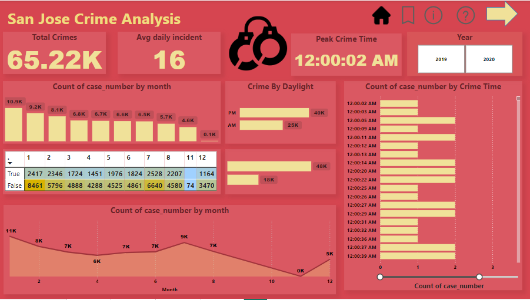
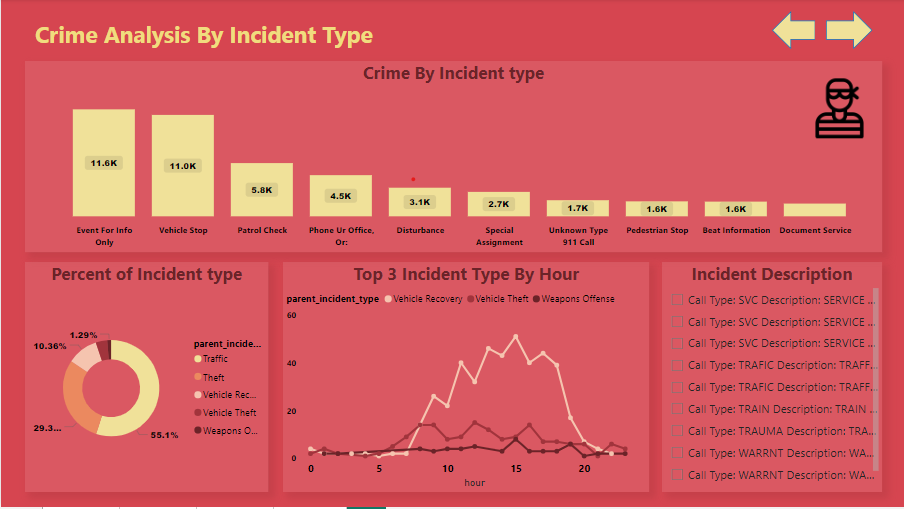
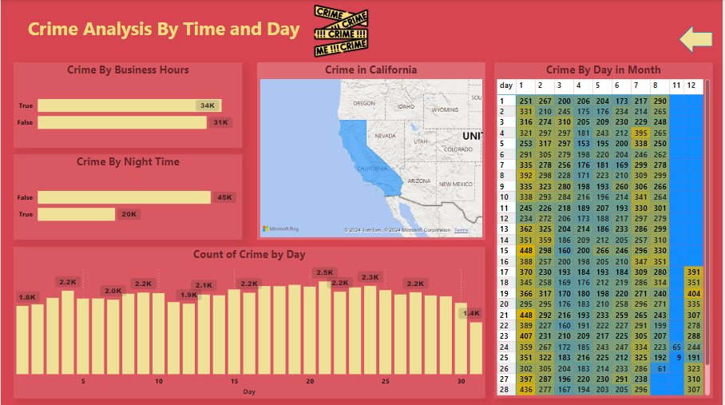

# San Jose Crime Analysis Dashboard

This project presents a comprehensive analysis of crime patterns in San Jose, focusing on time, day, and monthly trends. Built using Power BI, the dashboard provides visual insights for law enforcement and public safety strategists.

## Key Insights

### **General Overview**
1. **Total Crimes Analyzed:** 65.22K incidents over the selected timeframe.
2. **Average Daily Incidents:** 16 cases reported per day.
3. **Peak Crime Time:** Most crimes occur around **12:00 AM**, indicating a trend towards nighttime criminal activity.

### **Crime Trends**
1. **Crime by Month:** 
   - **Highest Crime Rate:** Occurs in January with approximately 10.9K cases.
   - **Lowest Crime Rate:** Observed in December, with only 4.6K cases.
2. **Crime by Time of Day:**
   - **Daylight Hours:** ~48K crimes.
   - **Nighttime Hours:** ~18K crimes.

### **Time and Day Analysis**
1. **Crime During Business Hours:** ~34K cases, indicating significant incidents during work hours.
2. **Crime at Night:** ~45K cases, highlighting a critical need for nighttime safety measures.
3. **Day-wise Crime Pattern:**
   - Crime rates are relatively consistent across days, with daily incidents ranging between 2.0K and 2.5K.
  

### **Geographical Insights**
- The map highlights crime distribution across California, with specific emphasis on incidents in San Jose.

### **Heatmap and Seasonal Trends**
1. **Crime by Day in Month:**
   - A heatmap indicates spikes in crime towards the beginning and end of certain months, particularly on the 28th day.
   - The most incidents (~391) occur on specific high-activity days.

---

## Features

1. **Dynamic Filters:** Switch between years (2019 and 2020) to explore trends for specific periods.
2. **Intuitive Visuals:**
   - Bar and line charts for monthly analysis.
   - Heatmaps for daily crime intensity.
   - Geographical maps for regional insights.
3. **Detailed Breakdown:** Separate views for crime by business hours and nighttime trends.

## Tools Used
- **Power BI** for data visualization.
- **Microsoft Bing Maps** for geographical analysis.
- SQL/Amazon S3 for preprocessing and data storage.

